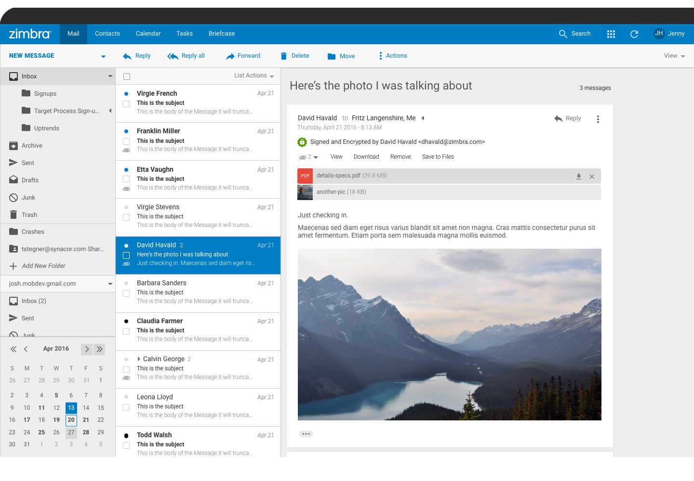

[[overview]]
= Zimbra Overview

Zimbra Collaboration is the world’s leading open source messaging and collaboration solution, trusted by more than 5,000 companies and public sector customers, and over 500 million end users, in over 140 countries.

Zimbra includes complete email, contacts, calendar, file-sharing and tasks, and can be accessed from the Zimbra Web client via any device. Featuring the most innovative cross-platform web application today, compatibility with all devices and desktops, Zimbra boosts end-user productivity at dramatically lower costs compared to other legacy solutions. Zimbra provides an open platform designed for virtualization and portability across private and public clouds, making it simpler to manage and more cost effective to scale. Zimbra is the world leader in Open Source based, next-generation messaging and collaboration software.

== New Features with Zimbra {product-version}
=== Next Generation Modules
NG modules include Real-time Backup, Synchronization of Shared Resources, HSM on Amazon S3 and a new simplified Delegated Admin. These are a subset of all the _Next Generation Tools_ coming in the product.

==== Realtime Backup & Restore (New in 8.8)
Zimbra’s new realtime backup and restore engine backs up every single item and event on your server with split second precision. It’s designed to avoid data loss using atomic and ever-consistent algorithms, while still saving disk space -- up to 50% -- thanks to an intelligent deduplication and compression system. It offers six restore features, from a single-item restore to complete disaster recovery. All of the restore modes are transparent to the end-user and are 100% OS, architecture and version independent.

==== Hierarchical Storage Management (HSM) (New in 8.8)
Featuring advanced Zimbra store management and HSM, you can now manage multiple volumes and HSM policies through your Zimbra Administration Console. Save additional valuable storage space, easily expand your Zimbra server by adding new volumes at will and improve your server performances by splitting the I/O load onto different storage media and use different tiers of storage equipment.

==== Mobile Sync (New in 8.8)
What’s new about Zimbra’s mobile sync functionality? Users can now sync their shared Zimbra items along with all of their other Zimbra data. Using Exchange ActiveSync protocol, which is natively supported by the vast majority of mobile devices, your data will always be at your fingertips, without any middleware or dedicated client.

==== Simplified Delegated Admin (New in 8.8)
In minutes, you can now grant Delegated Admin rights to users, allowing them to perform management tasks such as setting quotas, COS and user limits for your domains. Keep track of your Delegated Admins’ actions and your domain status with new reporting features, straight from your Zimbra Administration Console thanks to the dedicated Administration Zimlet.

=== Reconfigured IMAP Service (Beta in 8.8)
Zimbra 8.8 has a new refactored IMAP service to run separately from all other Zimbra services. IMAP will no longer affect SLAs! Zimbra 8.8 also has improved SIEVE RFC compliance, offering administrators greater email filtering.

=== Zimbra Chat
Now available in all versions of Zimbra! Peer-to-peer chat using XMPP. Know your company’s chat data is secure and private while your users enjoy searching chat history, emoticons, etc.

=== Zimbra Talk
Zimbra Talk brings secure, high-quality chat and videoconferencing right into the Zimbra Web Client. Users can chat and videoconference 1:1 and in groups, share files, share their screen and so much more.

=== Zimbra Drive
Zimbra Drive offers an integrated file sync and share functionality which needs to be built on an external ownCloud/Nextcloud platform. Zimbra Drive provides seamless synchronization and sharing of files between your users, wherever they are and on any device.

== Other Features
=== Two-Factor Authentication
Zimbra includes now two-factor authentication, making your mailbox more secure by providing a physical layer to produce a successful and secure login.

=== SSL SNI for HTTPS
Zimbra SSL SNI allows the server to present multiple certificates on the same IP address and TCP port number, so multiple hostnames can be served over HTTPS from the same IP address.

=== Postscreen for Zimbra MTA boosts Email Security
Keeping spambots away, Zimbra Postscreen leaves more SMTP server processes available for legitimate clients, and delays the onset of server overload conditions.

=== Zimbra Collaboration Packaging System
Apply security patches and Zimbra updates easier than ever before. Simply use your OS update commands, and all of your Zimbra packages will be updated as well. This is still a work in progress and full controls will be available in a future release.

=== S/MIME Digital Signatures and Encryption
Zimbra (Network Edition) provides cryptographic security services for email: authentication, message integrity, non-repudiation of origin (using digital signatures) and privacy and data security (using encryption). This old feature has been re-written to support all new standard browsers and work directly out of the box.

=== Exchange Web Services
If your users are using an enterprise email client like Microsoft Outlook, Zimbra provides Exchange Web Services, which allows your users to connect to their entire mailbox on a Mac. Microsoft Outlook 2011 and Microsoft Outlook 2016 are both supported.

=== Outlook Synchronization ZCO
If some of your users prefer to work with enterprise email client like Microsoft Outlook, Zimbra provides a MAPI Connector which allows your users see their entire mailbox in Microsoft Windows using Microsoft Outlook 2010 and above.

=== Archiving and Discovery
Zimbra Archiving & Discovery is an optional feature that enables you archive messages that were delivered to or sent by Zimbra and to search across mailboxes. It’s specially designed for legal and audit purposes.

== Zimbra Multi-Tenancy Value Addition (change title)
Zimbra is a multi-tenant platform that can natively host hundreds or thousands of domains with an array of service offerings. Within the Zimbra platform, a set of common service capabilities is called a "Class of Service" (COS), and COS settings can be used to automate users provisioning requirements and establish service levels. For example, one COS can be targeted at “Basic” users with basic services (Webmail, POP, and SMTP), while another COS can provide “Normal” or “Mobile” services (Zimbra Connector for Outlook, over-the-air ActiveSync for mobile devices, sharing calendaring, Documents, Briefcase, etc.).

Zimbra features and preferences can be set in the account profile for individual users or by the Class of Service (COS) for multiple users/groups when accounts are created. These settings can be modified at any time and are easily controlled via the Zimbra Admin interface. When deploying a Zimbra email infrastructure, multiple Class of Services can be defined and users will inherit the functions, features and branding associated with the COS to which they provisioned. When a user is provisioned into a specific COS they will automatic inherit the features and settings as defined in the COS, however it is possible to override COS attributes at a per user account level as part of the provisioning process.
