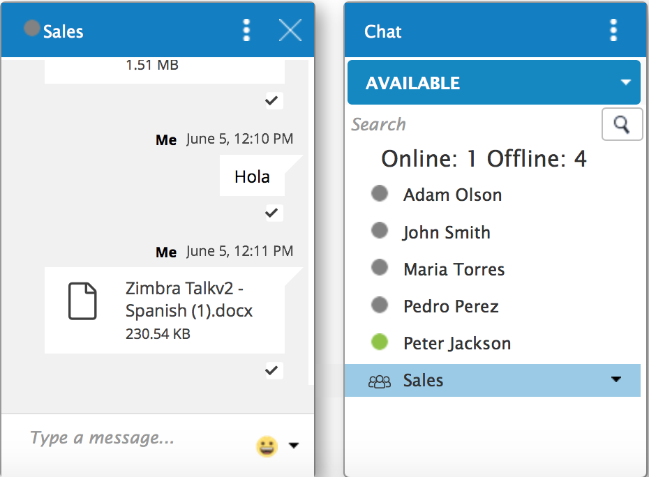
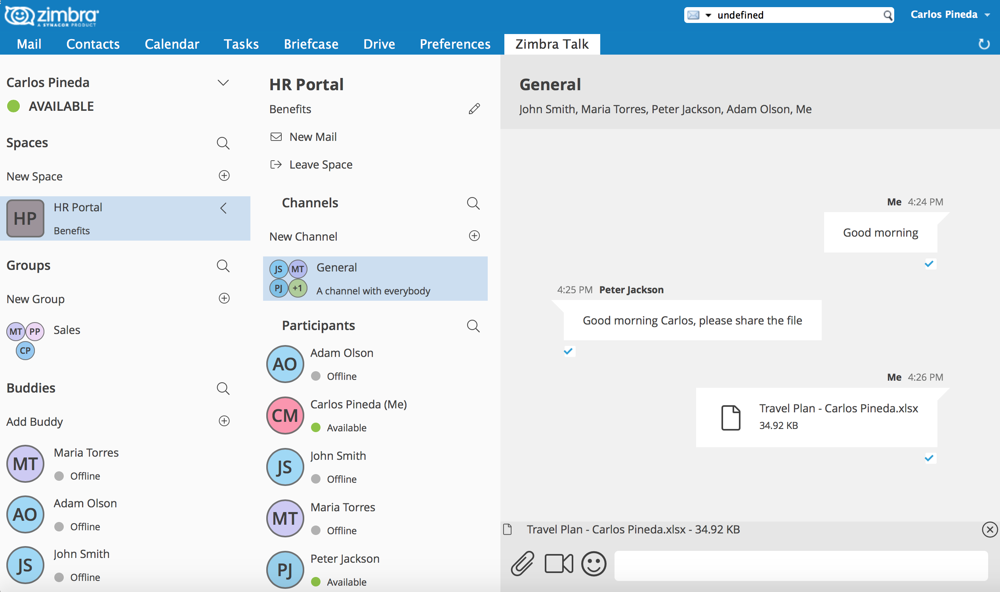
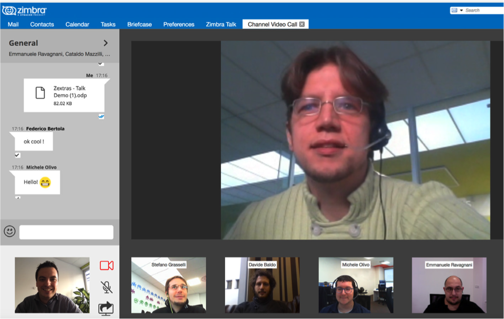

[appendix]
[[TALK]]
= Zimbra Connect

Zimbra Connect is chat and more, right in your Zimbra Web Client. Zimbra Connect integrates a fully fledged corporate instant messaging platform inside the Zimbra WebClient, including Group and Corporate Messaging, File Sharing, Screen Sharing and informal Video Chat capabilities.

Zextras Team includes the following front-end features:

* Message delivery and read awareness
* 1-to-1 Instant Messaging
* Group Messaging
* Corporate Messaging (Spaces and Channels)
* Group Video Calls
* Channel Video calls
* File Sharing
* Screen Sharing
* Emojis
* Mute conversations

includes the following backend features:

* COS and User availability
* Built-in TURN server compatibility
* No core installation needed. Zimlet installation through a package manager.
* No configuration needed
* Peer-to-Peer WebRTC protocol to avoid server load
* Dedicated audit log

Beginning in Zimbra Collaboration Network Edition 8.8.8, the Zimbra Connect Zimlet will provide the basic 1:1 chat features only. In order to enable the advanced chat and videoconferencing features per user, a purcharse of Zimbra Connect license is needed.

Zimbra Connect has two user interfaces: *Chat Panel and Zimbra Connect tab*.

The *Chat Panel* is available to all users - basic and advanced - for text messaging. Advanced users will have the additional options of videoconferencing and file sharing in the panel.

The *Zimbra Connect* tab is only available for advanced Zimbra Connect users. This tab offers all of the corporate instant messaging features such as Spaces and Channels.

Advanced Zimbra Connect users will have three options to interact with other users: Groups, Spaces, and Channel.

*Groups*

Groups are the basic way of communicating with multiple people at the same time (up to 5 total). Those are non-persistent entities that are not tied to any specific space: any user can create a group inviting people from their Buddy List and any group member can invite more people in the same way. When all users leave a group, the group itself ceases to exist.

*Groups Features*

* A user in a Group can add more users to the Group itself up to the allowed limit

* A user in a Group can chat with all of the others. Messages sent in a Group are viewed by all members of that Group

* A user in a Group can send files to all of the others. Files sent in a Group are available to all members of that Group

* A user in a Group can start a videoconference with all of the others. Group videoconferences can be joined at any time by all members of the Group

*Spaces*

Spaces are a themed container that can hold any number of Channels. A Space is a community portal where people gather to discuss different topics in dedicated areas (named Channels).

*Spaces Features*

* Each space has a unique name and topic. The name cannot be changed after creating the space but the Topic can be edited

* Users in a space can send an email to all members of that space

* Members can leave a space at any time

* Members can create new channels and invite new people to the space

*Channels*

Channels are topic-defined areas inside of a same space. Those can contain any number of users, and unlike groups, users are able to autonomously join any Channel in a Space they are in instead of being invited to it by a member.

*Channels Features*

* A user in a Channel can chat with all of the others

* A user in a Channel can send files to all of the others

* A user in a Channel can start a videoconference with all of the others

* Channel videoconferences can be joined at any time by all members of the Channel

*Videoconferencing*

Videoconferencing features are available in both Groups and Channels, allowing multiple people to communicate in real-time using a webcam and a headset as well as allowing them to share their screen with all other attendees.

This feature is based on the WebRTC protocol, a peer-to-peer auto-adaptive technology that allows clients to communicate directly without overloading the server and whose call quality is automatically tweaked based on the available bandwidth - with the maximum quality being Full HD for both video and audio. The first time a Videoconference is started, users will need to grant their browser access permissions to their camera and microphone.

*Video Server*

Video Server is a WebRTC stream aggregator that improves Connect'ss performance by merging and decoding/re-encoding all streams in a meeting. While the default WebRTC creates one incoming and one outgoing stream per meeting participant, with the Connect Video Server, each client will only have one aggregated inbound stream and one aggregated outbound stream. This applies for both video and audio.

Consider a meetings with 5 people ...

* Without Video Server: each client generates 4x outgoing video/audio streams and receives 4 incoming video/audio streams
* With Video Server: each client generates 1 outgoing video/audio stream and receives 1 incoming video/audio stream

The Video Server uses conservative Codecs (VP8 and Opus) to ensure the broadest compatibility, but more codecs can be enabled. It also splits the Webcam and Screen Sharing streams and reserves the same bandwidth for both.

A properly set up Video Server will supersede the need of a TURN server, provided that all clients can reach the Video Server’s public IP and that UDP traffic is not filtered.