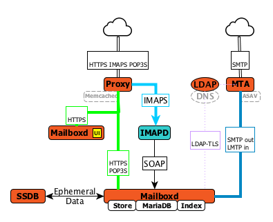

[[tech]]
= Technical Overview

Zimbra architecture consists of many components integrated using industry standard protocols. There are more than 80 different open source components in use and The architecture includes the following core advantages:

* *Open source integrations*: Linux(R), Jetty, Postfix, MariaDB(R), OpenLDAP(R), NGINX(R), etc.
* *Uses industry standard open protocols*: SMTP, LMTP, SOAP, POP3, IMAP4, LDAP, HTTP
* *Modern technology design*: Java, JavaScript, React
* *Horizontal Scalability*: Each mailbox server includes its own data store, message store, and set mailbox accounts. You don’t change anything on existing servers to scale the system. To scale for additional mail accounts, add more servers.
* *High Availability support*: High availability can be achieved in partnership with products like VMware vSphere.
* *Browser-based* client and admin interface

== Supported Operating Systems
Zimbra Collaboration Network Edition v8.6.x, v8.7.x and later is supported on the following operating systems:

* Red Hat Enterprise Linux 7
* CentOS Linux 7
* Red Hat Enterprise Linux 6, patch level 4 or later is required
* CentOS Linux 6, patch level 4 or later is required
* Oracle Linux 7.2
* Oracle Linux 6.6
* Ubuntu 16.04 LTS
* Ubuntu 14.04 LTS

== Zimbra Components Overview
Zimbra is designed to provide an end-to-end mail solution that is scalable and highly reliable. There are 4 major services in Zimbra described below. You can also have all of the services running on a single virtual server or they can be installed separately on multiple servers. If you have less than 1,000 users, it is very common to have only a single virtual server running all of the Zimbra processes.

In the Zimbra architecture, you can mix and match these services on a server basis. For example, you may have a server that is running the proxy and MTA services, and you may have another server on the backend running the mailboxd and the LDAP services. You can also have different virtual servers for each environment. For example, you might have a virtual server that is running a proxy, a virtual server that is running the MTA, a virtual server that is running LDAP, and a virtual server that is running the mailbox service.

=== LDAP
This is the heart of the Zimbra architecture based on the open source project OpenLDAP(R). Every implementation of Zimbra must have the Zimbra LDAP instance.

The LDAP service holds all of the configuration information needed to run the Zimbra environment. There is account information in the LDAP database that includes the username, password, and all other attributes associated with that account, including the mailbox server that the account resides on, the preferences for each user, etc. Zimbra can also integrate with other directories for wider network requirements or external lookups.

LDAP also stores the domain information. With each email domain that you create in Zimbra, there is specific configuration information included, such as how does authentication occur for this domain; where does the global address list reside for this domain; and Class of Service information, where you can group users by features.

LDAP can also look up email delivery addresses both from internal and external LDAP servers as well. Zimbra supports the proxying of user login and Global Address List (GAL) access to an existing enterprise directory such as Microsoft Active Directory or other LDAP-compliant directories. The ideal configuration seems to be store Zimbra specific configuration data within the Zimbra managed, embedded OpenLDAP and store independent enterprise configuration data within the existing enterprise directory. To provide scalability and redundancy, the Master LDAP server can be horizontally scaled by deploying multiple replica servers or be configured in a multi-master replication mode.

=== MTA
The MTA service is responsible for receiving email from the internet and delivering it to mailboxes in the Zimbra environment. It also delivers email sent by Zimbra users out-bound or to other internal users. It serves in the Zimbra architecture as a relay point for archiving.

Internally, Local Mail Transfer Protocol (LMTP) is used to route the emails to the appropriate Zimbra mailbox server. The Zimbra MTA server includes the following programs:

* Postfix MTA, for mail routing, mail relay, and attachment blocking
* ClamAV - Anti-Virus engine
* SpamAssassin - Spam filters
* Amavis - interface between Postfix and ClamAV/SpamAssassin

In the Zimbra configuration, mail transfer and delivery are distinct functions. Postfix primarily acts as a Mail Transfer Agent (MTA) and the Zimbra mail server acts as a Mail Delivery agent (MDA).

Most SME/SMB or larger enterprises will require a 3rd party AS/AV solution that is more enterprise grade or carrier grade. The Zimbra AS/AV is turned off or only some of the features are used. SpamAssassin is an open source project and does not have the fine grained administration features for better control and flexibility.

[NOTE]
As the user base grows and domains become popular, the environments is more susceptible to spammers. An enterprise or carrier grade solution becomes mandatory.

=== Mailboxd
The mailboxd process is where all the hard work is done. It controls everything from presenting the web client to users, so they see their mailbox data, to responding to other mail client requests for POP and IMAP and delivering the mail to those environments. It is responsible for storing messages on disk and providing indexing for those messages. It also maintains the MariaDB database that has the information for calendar, contacts, and tasks.

One of the differences post the Zimbra 8.5 architecture is that we split out the mailboxd process. You now have the option of running static content separately from dynamic content. There is a mailboxd user interface node option in addition to the traditional mailboxd process, which includes the message store, the database information, and the indexing information. This is optional. You do not have to split out these two components.

=== Proxy
The Zimbra Proxy is a high performance POP/IMAP/HTTP proxy server that allows end users to access their Zimbra account using end clients such as Chrome/Firefox/IE/Safari, Microsoft Outlook (Windows and Mac), Mozilla Thunderbird, or other POP/IMAP end client software.

Traditionally, we separate what is exposed to the internet and what is behind a firewall. The proxy server and the MTA server traditionally live in what is known as the DMZ or demilitarized zone, which is a security zone that is exposed to the internet. The proxy server listens for requests from the client and then translates across different ports, communicating with the mailboxd servers on the backend. This provides a layer of security on the backend. The proxy service is listening on the traditional protocols of HTTPS, IMAPS, and POP3S, which are secure ports 443, 995, and 993. It translates the incoming requests to different ports: the mailboxd process in not listening on port 443, it is listening on port 8443; it is not listening on port 993, it is listening on 7993; it is not listening on port 995, it is listening on port 7995. This becomes a layer of security, with the proxy service out front and the mailboxd processes separate.

Proxying allows users to enter _imap.example.com_ as their IMAP server, rather than remembering the actual mailbox server the user has been provisioned on. Encapsulation provides a layer of security and the proxy does a lookup to determine which backend mailbox server a user’s mailbox lives on and transparently proxies the connection from user’s client to the correct mailbox server.

In addition to IMAP/POP3 proxying, the Zimbra proxy package based on NGINX is also able to reverse proxy HTTP requests to the right backend server. Using an Nginx based reverse proxy for HTTP helps to hide names of backend mailbox servers from end users. For example, users can always use their web browser to visit the proxy server at https://mail.example.com. The connection from users’ whose mailboxes live on mbs1.example.com is proxied to mbs1.example.com by the proxy running on the mail.example.com server. Clients such as REST and CalDAV clients, Zimbra Connector for Outlook, and Zimbra Mobile Sync devices are all supported by the Zimbra Proxy.

== Client Access
Zimbra features compatibility with Microsoft Outlook (both Windows and Mac), Apple Desktop applications, and all other standards based POP/IMAP/iCal/CalDAV/CardDAV clients. Our broad desktop compatibility gives end-users freedom of choice and administrators the ability to protect their desktop investments because mixed PC, Mac, and Linux desktop deployments can all talk to the same Zimbra Server. The <<flow_arch, mail flow>> diagram below shows some of the more common methods of access and indicates the protocols used to interact with the Zimbra Mailstore.

The Zimbra Connector for Outlook (ZCO) provides real time two-way synchronization of mail, contacts, tasks, and calendar between Outlook and the ZCS server. Outlook for Mac works similarly using the EWS (Exchange Web Services) interface with the ZCS server. Standards-Based clients such as Mozilla Thunderbird, Sunbird, and Eudora can be used with Zimbra to access email and even calendar data because the Zimbra Server uses an all standards-based approach and supports POP, IMAP, iCal, CalDAV, RSS, etc.

[[flow_arch]]
image::images/mail_flow.jpg[Mail Flow, 800]

=== Mobile Access
Zimbra Mobile for smartphones enables two-way, over-the-air synchronization of mail, contacts, calendar and tasks data between the mobile device and the Zimbra Server. It features push email, which sends messages in real time to your device when it arrives on the Zimbra Server. Supported devices must be ActiveSync compatible, for example Apple iPhones, Android smartphones from Samsung, HTC, etc.

Zimbra’s mobile access is further enhanced via its Mobile Web Client.

* Mobile Web Browsers - All devices with HTML capable browsers, have real time access to the Zimbra Server using our Mobile Web Client. Zimbra’s Mobile Web Client allows users access to their email, contacts, and calendar. This provides on-the-go access to the Zimbra experience to virtually all end-users.
* Responsive Design – Zimbra web client adapts itself to the device being used. Tablets have a new layout based on the Sencha framework and the smaller mobile browsers use an xHTML format.

===  Flow — Multi-Server Configuration
The configuration for each deployment is dependent on numerous variables such as the number of mailboxes, mailbox quotas, performance requirements, existing network infrastructure, IT policies, security methodologies, spam filtering requirements, and more. In general, deployments share common characteristics for incoming traffic and user connectivity, as depicted in the following diagram. Alternate methods for configuring numerous points within the network are also possible.

image::images/mailflow.jpg[Mail Flow, 800]

The numbered sequences are described below:

1. Inbound Internet mail goes through a firewall and load balancing to the edge MTA for spam filtering.

2. The filtered mail then goes through a second load balancer.

3. An external user connecting to the messaging server also goes through a firewall to the second load balancer.

4. The inbound Internet mail goes to any of the Zimbra Collaboration MTA servers and goes through spam and virus filtering.

5. The designated Zimbra Collaboration MTA server looks up the addressee’s directory information from the Zimbra Collaboration LDAP replica server.

6. After obtaining the user’s information from the Zimbra Collaboration LDPA server, the MTA server sends the mail to the appropriate Zimbra Collaboration server.

7. Internal end-user connections are made directly to any Zimbra Collaboration server that then obtains the user’s directory information from Zimbra Collaboration LDAP and redirects the user, as needed.

8. The backups from the Zimbra Collaboration servers can be processed to a mounted disk.
